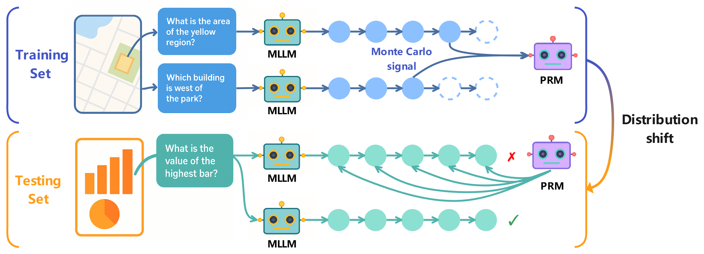
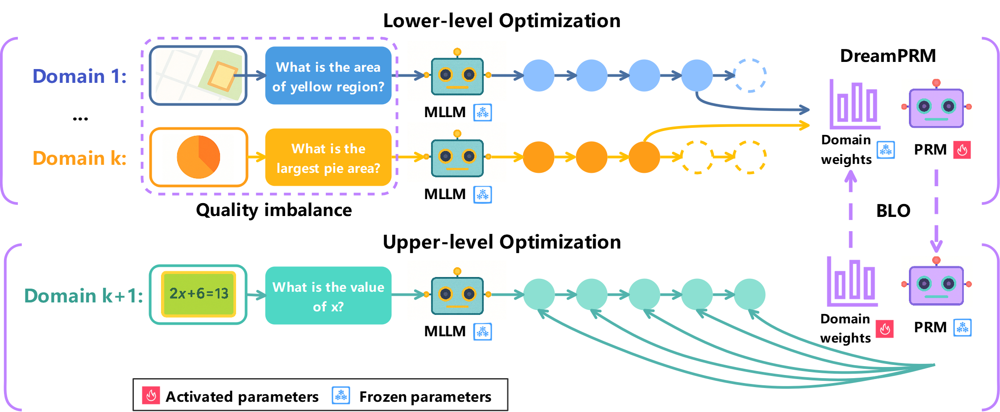
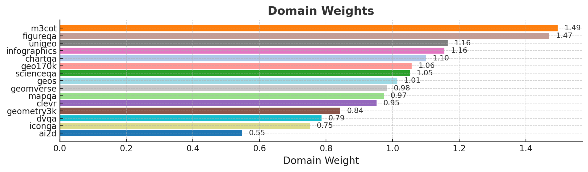

## Method Overview

> **DreamPRM — Domain-Reweighted Process Reward Model for Multimodal Reasoning**  
> DreamPRM tackles the dataset *quality imbalance* and *distribution shift* that plague multimodal reasoning.  
> It jointly learns (i) a high-fidelity Process Reward Model (PRM) and (ii) optimal domain weights through a bi-level optimisation (BLO) loop, delivering a consistent **+4 pp** average gain on five public benchmarks. 

<!-- TODO: swap in your high-level diagram -->




### Key Components

| Component | Purpose | Highlight |
|-----------|---------|-----------|
| **Domain-Reweighted Fine-Tuning** | Re-weights K training domains via parameters αₖ | Gives harder, higher-quality datasets greater gradient influence |
| **Bi-Level Optimisation (BLO)** | Lower level updates PRM weights ϕ; upper level updates α | Learns *both* model and data weights in one run |
| **Aggregation Function Loss** | Meta-level loss that mirrors inference-time scoring | Aligns training with real PRM usage |
| **Structural Thinking Prompt** | 5-step CoT template (Restate → Evidence → Context → Reason → Conclude) | Produces interpretable, stable reasoning traces |

<!-- TODO: swap in your domain-weight visualisation -->


DreamPRM’s learned domain weights span **0.55–1.49**, down-weighting noisy sets like *AI2D* and up-weighting challenging ones like *M3CoT*. This correlation with dataset difficulty underpins its performance gains.

---

## Code Usage

> *All commands below are illustrative—rename scripts / paths to match your repo.*

### 1  Environment

```bash
# (a) create conda env
conda create -n dreamprm python=3.10 -y
conda activate dreamprm

# (b) install requirements
pip install -r requirements.txt   # torch betty, transformers, accelerate, ...
```
### 2  Domain-reweighting
Data preparation key steps:
```bash
# (a) Prepare data for Monte Carlo estimation
python inference/InternVL/InternVL_2_5_MPO_8B/InternVL_MPO_MMPR.py --path <Project root path> --gpu <GPU device ID (CUDA_VISIBLE_DEVICES)> 
python MC/Tree_generation.py --path <Project root path> --gpu <GPU device ID (CUDA_VISIBLE_DEVICES)>

# (b) Monte Carlo estimation
python MC/MC_inference_InternVL_MPO.py --path <Project root path> --gpu <GPU device ID (CUDA_VISIBLE_DEVICES)>

# (c) Domain-reweighting dataset generation
python MC/train_data_generation.py --path <Project root path> --gpu <GPU device ID (CUDA_VISIBLE_DEVICES)>
python inference/meta_data_generation.py --path <Project root path> --gpu <GPU device ID (CUDA_VISIBLE_DEVICES)>
```

Domain reweighting for PRM fine-tuning:
```bash
python reweighting/main.py --path <Project root path> --gpu <GPU device ID (CUDA_VISIBLE_DEVICES)>
```
### 3  Other tools
Dataset download:
```bash
 dataset/
 ├── M3CoT
 ├── ...
 └── WeMath
```
Inferencing:
```bash
 inference/InternVL/InternVL_2_5_MPO_8B/
 ├── InternVL_MPO_M3CoT.py
 ├── ...
 └── InternVL_MPO_WeMath.py
```
BoN verification using DreamPRM
```bash
python BoN/BoN_verification.py --path <Project root path> --gpu <GPU device ID (CUDA_VISIBLE_DEVICES)>
```

