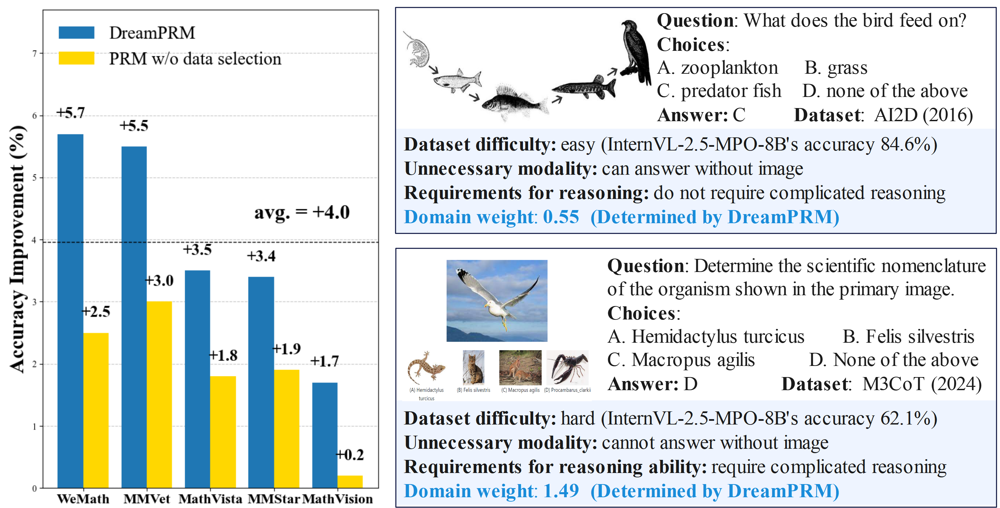
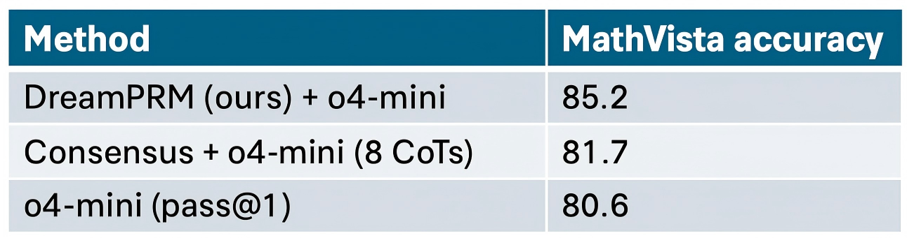

# DreamPRM: Domain-Reweighted Process Reward Model for Multimodal Reasoning
This repository holds the code and data of [DreamPRM: Domain-Reweighted Process Reward Model for Multimodal Reasoning](https://arxiv.org/abs/2505.20241).

* Update on Jun 4, 2025: release codes and paper
* Update on Jun 9, 2025: **DreamPRM (o4-mini)** has been added to the top of the [**MathVista Leaderboard (testmini)**](https://mathvista.github.io/#leaderboard) with **85.2% accuracy**!
* Update on Jun 10, 2025: update instructions for extending DreamPRM to o4-mini
> **DreamPRM — Domain-Reweighted Process Reward Model for Multimodal Reasoning**  
> DreamPRM tackles the dataset *quality imbalance* and *distribution shift* that plague multimodal reasoning by *domain-reweighting*.  
> It jointly learns (i) a high-fidelity Process Reward Model (PRM) and (ii) optimal domain weights through a bi-level optimisation (BLO) loop, delivering a consistent **+4 pp** average gain on five public benchmarks. 

## Table of Contents
1. [Example](#example)
2. [Method Overview](#installation)
3. [Quick Start](#quick-start)
4. [Customize Your Datasets](#customize-your-own-datasets)
5. [Extend DreamPRM to o4-mini **(new)**](#o4-mini)
6. [Acknowledgement](#acknowledgement)
7. [License](#license)
8. [Citation](#citation)

## Example <a name="example"></a>


 DreamPRM improves multimodal reasoning by mitigating the dataset quality imbalance problem. 
 **Left**: On five benchmarks, DreamPRM outperforms base model (InternVL-2.5-8B-MPO) by an average of +4.0%. DreamPRM also consistently surpasses Vanilla PRM trained
without data selection. 
 **Right**: Easy AI2D questions (weight 0.55) vs. hard M3COT questions (weight 1.49) shows how DreamPRM prioritizes data that demand deeper reasoning - samples
requiring knowledge from both textual and visual modalities for step-by-step logical deduction.



DreamPRM significantly outperforms o4-mini in pass@1 accuracy (with temperature fixed at 1.0, following OpenAI API defaults), achieving a **4.6%** absolute improvement. It also surpasses the widely used **self-consistency** (Consensus) method based on majority voting for reasoning chain selection.


## Method Overview <a name="installation"></a>
### Method flowchart
<!-- Method -->

 General flow of training PRM and using PRM for inference. 
 **Training phase**: Train PRM with Monte Carlo signals from intermediate steps of Chain-of-Thoughts (CoTs). 
 **Inference phase**: Use the trained PRM to verify CoTs step by step and select the best CoT. Conventional
training of PRM has poor generalization capability due to distribution shift between training set and
testing set.


The proposed bi-level optimization based domain-reweighting method. 
**Lower-level optimization**: In this stage, PRM’s parameters are updated on multiple datasets with domain weights,
allowing the PRM to prioritize domains with better quality. 
**Upper-level optimization**: In this stage, the PRM is evaluated on a separate meta dataset to compute an aggregation function loss and optimize
the domain weights. 

### Key Components

| Component | Purpose | Highlight |
|-----------|---------|-----------|
| **Domain-Reweighted Fine-Tuning** | Re-weights K training domains via parameters αₖ | Gives harder, higher-quality datasets greater gradient influence |
| **Bi-Level Optimisation (BLO)** | Lower level updates PRM weights ϕ; upper level updates α | Learns *both* model and data weights in one run |
| **Aggregation Function Loss** | Meta-level loss that mirrors inference-time scoring | Aligns training with real PRM usage |

### Domain weights results
<!-- TODO: swap in your domain-weight visualisation -->


DreamPRM’s learned domain weights span **0.55–1.49**, down-weighting noisy sets like *AI2D* and up-weighting challenging ones like *M3CoT*. This correlation with dataset difficulty underpins its performance gains.

---

## Quick Start <a name="quick-start"></a>

> *All commands below are illustrative—rename scripts / paths to match your repo.*
### 1. Codes
Git clone our repository, creating a python environment and ativate it via the following command

```bash
git https://github.com/coder-qicao/DreamPRM.git
cd DreamPRM
```

### 2. Environment

```bash
# (a) create conda env
conda create -n dreamprm python=3.10 -y
conda activate dreamprm

# (b) install requirements
pip install -r requirements.txt   # torch betty, transformers, accelerate, ...
```
Verify the installation of `torch` and `torchvision` is successful by running `python -c "import torchvision; print(torchvision.__version__)"`. If it outputs the version number without any warnings or errors, then you are good to go. __If it outputs any warnings or errors__, try to uninstall `torch` by `conda uninstall pytorch torchvision torchaudio cudatoolkit` and then reinstall them following [here](https://pytorch.org/get-started/previous-versions/#v1121). You need to find the correct command according to the CUDA version your GPU driver supports (check `nvidia-smi`). 
### 3. Domain-reweighting
The current version of DreamPRM is built on Qwen2-VL-2B-Instruct.
Please download Qwen2-VL weights from [https://huggingface.co/Qwen/Qwen2-VL-2B-Instruct](https://huggingface.co/Qwen/Qwen2-VL-2B-Instruct).

Domain-reweighting for DreamPRM fine-tuning:
```bash
python main.py \\
  --train_json_file "data/train.json" \\
  --meta_json_file "data/meta.json" \\
  --weights_path "weights"\\
```
**You need at least 80 GB GPU memory for the training.** 

### 4. Configuration Parameters
In addition, you may want to change the number of epochs and other hyper-parameters there, such as `iteration_num`, `unroll_steps`, `gradiant_accumulation`,`lr`, `scheduler_step_size`, etc.

### Data & Model Paths
| Argument | Type | Default | Description |
|----------|------|---------|-------------|
| `--train_json_file` | str | *None* | Path to training dataset JSON file |
| `--meta_json_file` | str | *None* | Path to meta dataset JSON file |
| `--weights_path` | str | *None* | Directory to save/load model weights |
| `--reward_model` | str | "Qwen/Qwen2-VL-2B-Instruct" | Pretrained reward model identifier |

### Training Setup
| Argument | Type | Default | Description |
|----------|------|---------|-------------|
| `--iteration_num` | int | 10000 | Total training iterations |
| `--batch_size` | int | 1 | Training batch size |
| `--max_epoch` | int | 120 | Maximum training epochs |
| `--device` | str | "cuda" | Compute device ("cuda" or "cpu") |
| `--precision` | str | "bf16" | Floating point precision (bf16/fp16/fp32) |
| `--strategy` | str | "default" | Training strategy (default) |
| `--seed` | int | 1 | Random seed for reproducibility |
| `--local_rank` | int | 0 | Local rank for distributed training |

### Optimization Parameters
| Argument | Type | Default | Description |
|----------|------|---------|-------------|
| `--lr` | float | 5e-7 | Main optimizer learning rate |
| `--meta_lr` | float | 0.01 | Meta-optimizer learning rate |
| `--weight_decay` | float | 1e-3 | Weight decay (L2 penalty) |
| `--meta_weight_decay` | float | 0.0 | Meta-optimizer weight decay |
| `--scheduler_step_size` | int | 5000 | Steps between LR adjustments |
| `--scheduler_gamma` | float | 0.5 | LR decay multiplier |

### Advanced Training
| Argument | Type | Default | Description |
|----------|------|---------|-------------|
| `--unroll_steps` | int | 5 | Unrolled optimization steps |
| `--gradiant_accumulation` | int | 1 | Gradient accumulation steps |

### Checkpoint & Visualization
| Argument | Type | Default | Description |
|----------|------|---------|-------------|
| `--save_every_iterations` | int | 1000 | Checkpoint save interval |

### Example Usage

```bash
python main.py \\
  --train_json_file data/train.json \\
  --meta_json_file data/meta.json \\
  --weights_path models/dreamprm \\
  --iteration_num 20000 \\
  --lr 1e-6 \\
  --meta_lr 0.05 \\
  --precision bf16 \\
  --reward_model "Qwen/Qwen2-VL-7B-Instruct" \\
  --unroll_steps 8 \\
  --save_every_iterations 500
```

## Customized Your Datasets <a name="customize-your-own-datasets"></a>
We provide demo datasets with 10 domains (10k training samples) and 500 meta samples in our repository:
```bash
data/
├── meta.json
└── train.json
```
### Training Dataset Format (for lower-level optimization)
Each sample in the training dataset should follow this format:
```python
{
    "id": 1128,                   # Unique question identifier
    "sid": 1,                     # Step number identifier
    "input": "Your task is...",    # Full question prompt
    "add": "Step 1: Restate...",   # Model's partial response
    "ground_truth": "1.78947",     # Correct final answer
    "image_path": "dataset/...",   # Path to input image
    "dataset": "chartqa",          # Domain name
    "score": 7,                    # Monte Carlo score
    "times": 11,                   # Monte Carlo iterations
    "accuracy": 0.6363             # Estimated accuracy (0-1)
}
```
### Minimal Custom Training Sample Format:
```python
{
    "input": "...",                # Question prompt (required)
    "add": "Step 1: ...",          # Model's partial response (required)
    "image_path": "xxx.png",       # Input image path (required)
    "dataset": "...",              # Domain name (required)
    "accuracy": 0.6363             # Estimated accuracy (0-1, required)
}
```
### Meta Dataset Format (for upper-level optimization)
Each sample in the meta dataset should follow this format:
```python
{
    "id": 2,                       # Unique question identifier
    "true_false": True,             # Ground truth label
    "input": "Question: The...",    # Full question + model response
    "image_path": "dataset/..."     # Path to input image
}
```
### Minimal Custom Meta Sample Format:
```python
{
    "true_false": True,             # Boolean ground truth (required)
    "input": "Question: ...",       # Full question + model response (required)
    "image_path": "xxx.png"         # Input image path (required)
}
```

## Extend DreamPRM to o4-mini <a name="o4-mini"></a> 

DreamPRM can be extended to stronger models by leveraging your customized meta training set. In this section, we demonstrate how to apply DreamPRM to **o4-mini**.
### Prepare o4-mini CoTs

Generate multiple **Chains of Thought (CoTs)** using o4-mini. We highly recommend enabling **high reasoning effort mode** to produce richer and more reliable reasoning paths.

```python
from openai import OpenAI

client = OpenAI(api_key=api_key)
response = client.responses.create(
    model="o4-mini",
    reasoning={"effort": "high"},
    input=prompt,
)

```
We suggest generating **8 diverse CoTs** per question to enable best-of-N selection.

To improve response structure and clarity, we recommend using a **structured thinking** prompt that clearly outlines each reasoning step:
```python
# Structured prompting for o4-mini
prompt = """
You have been given a question that involves both an image and a text. 
Your task is to analyze the question by following exactly five steps:

Step 1: Restate the question.
  - Clearly rephrase or clarify the question in your own words.

Step 2: Gather evidence from the image.
  - Describe relevant visual details (e.g., objects, people, locations, interactions) that may help answer the question.

Step 3: Identify any necessary background knowledge.
  - List any general facts or assumptions required to answer the question.

Step 4: Reason using the available evidence.
  - Integrate the image, text, and background knowledge to form a coherent reasoning path.

Step 5: Summarize and conclude.
  - Provide a concise answer, supported by the reasoning in previous steps.

Finally, report your answer in the following format:

Final answer: ...

Question: ... (Insert question here)
"""

```

### Train PRM with o4-mini meta training set
DreamPRM's upper-level optimization provides realistic simulation of reasoning. To maximize performance with o4-mini, we recommend creating a **custom meta-training set** ~~using CoTs and responses generated by o4-mini, with careful domain selection tailored to the model’s strengths.

A sample format for meta-training data:
```python
{
    "true_false": True,             # Ground truth label (required)
    "input": "Question: ... + (Insert o4-mini response here)",  # Full input prompt + model response (required)
    "image_path": "xxx.png"         # Path to the input image (required)
}

```
### Best-of-N selection using re-trained PRM
Use the re-trained PRM to select the most promising CoT among the candidates. Try different **aggregation functions**—such as mean, log-mean, or other variants—to evaluate and aggregate step-level scores effectively.

---
## Acknowledgement <a name="acknowledgement"></a>

+ [InternVL](https://github.com/OpenGVLab/InternVL)
+ [Qwen2-VL](https://github.com/QwenLM/Qwen2.5-VL)
+ [MathVista](https://mathvista.github.io/) 
+ [M3CoT](https://github.com/LightChen233/M3CoT)
+ [Betty](https://github.com/leopard-ai/betty)

## License <a name="license"></a>
This repository is under [Apache License 2.0](LICENSE.md).


## Citation <a name="citation"></a>
If you use this work in your research, please cite:
```bibtex
@misc{cao2025dreamprmdomainreweightedprocessreward,
      title={DreamPRM: Domain-Reweighted Process Reward Model for Multimodal Reasoning}, 
      author={Qi Cao and Ruiyi Wang and Ruiyi Zhang and Sai Ashish Somayajula and Pengtao Xie},
      year={2025},
      eprint={2505.20241},
      archivePrefix={arXiv},
      primaryClass={cs.LG},
      url={https://arxiv.org/abs/2505.20241}, 
}
```